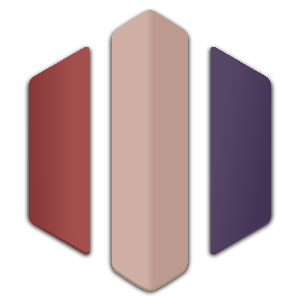

 

  

<h3 align="center">website-new</h3>

  

    The official website for the <a href="https://discord.gg/bridgescrims">bridge scrims Discord server</a>.
     
    <a href="https://github.com/bridge-scrims/website-new"><strong>Explore the docs »</strong></a>
     
     
    <a href="https://github.com/bridge-scrims/website-new">View Demo</a>
    ·
    <a href="https://github.com/bridge-scrims/website-new/issues">Report Bug</a>
    ·
    <a href="https://github.com/bridge-scrims/website-new/issues">Request Feature</a>
  

### Built With
[![Next][Next.js]][Next-url] [![Bootstrap][Bootstrap.com]][Bootstrap-url]

<!-- CONTRIBUTING -->
## Contributing

Contributions are what make the open source community such an amazing place to learn, inspire, and create. Any contributions you make are **greatly appreciated**.

If you have a suggestion that would make this better, please fork the repo and create a pull request. You can also simply open an issue with the tag "enhancement".
Don't forget to give the project a star! Thanks again!

1. Fork the Project
2. Create your Feature Branch (`git checkout -b feature/AmazingFeature`)
3. Commit your Changes (`git commit -m 'Add some AmazingFeature'`)
4. Push to the Branch (`git push origin feature/AmazingFeature`)
5. Open a Pull Request

<!-- LICENSE -->
## License

Distributed under the MIT License.

<!-- CONTACT -->
## Contact

[Discord Server](https://discord.gg/bridgescrims)

Project Link: [https://github.com/bridge-scrims/website-new](https://github.com/bridge-scrims/website-new)

<!-- ACKNOWLEDGMENTS -->
<!-- ## Acknowledgments -->

<!-- *  -->
<!-- *  -->
<!-- *  -->

<a href="#readme-top">back to top</a>

[Next.js]: https://img.shields.io/badge/next.js-000000?style=for-the-badge&logo=nextdotjs&logoColor=white
[Next-url]: https://nextjs.org/
[Bootstrap.com]: https://img.shields.io/badge/Bootstrap-563D7C?style=for-the-badge&logo=bootstrap&logoColor=white
[Bootstrap-url]: https://getbootstrap.com
